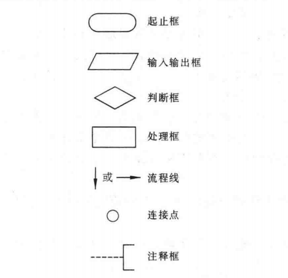
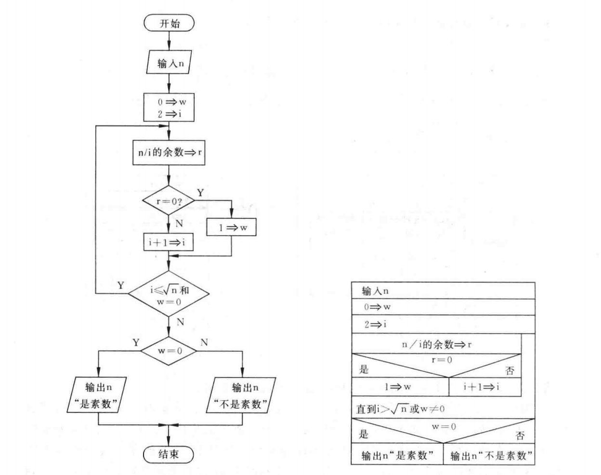

# 00-计算机程序概念

## 一 计算机与程序设计

### 1.1 程序运行平台

现代计算机系统可以分为两个部分：

- 硬件：提供具有广泛通用型的计算平台，决定了计算机系统的性能
- 软件：描述计算任务的处理对象和处理规则，决定了计算机系统的功能

硬件和软件两部分组成了程序的运行平台（计算机系统），运行平台中与程序设计直接相关的硬件配置主要是：

- CPU 类型：计算机运行的核心部件
- 内存大小：计算机在运行时保存程序代码和中间运算结果的线性存储空间，一般以字节为单位，各个存储单元的编号称为存储单元的地址。

其中与程序设计直接相关的软件配置主要是：操作系统、编译系统。

### 1.2 程序设计技术

计算机软件的重要支撑技术就是程序设计技术，其基本过程分为 5 个步骤：

- 问题分析：了解需要做什么
- 设计：说明怎么做
- 编码：使用编程语言描述自己的意图，生成计算机可执行程序
- 调试：验证程序是否满足需求
- 测试：处理程序运行中的错误等

常见概念：

- **程序**：一组计算机能识别和执行的指令。
- **程序设计**：每一条指令使计算机执行特定的操作，只要让计算机执行这个程序，计算机就会自动执行各条指令。为了使计算机系统能够实现各种功能，需要成千上万的程序，这些程序大多由软件开发人员根据需求设计好的。

著名计算机科学家沃思提出了一个公式：

> 算法 + 数据结构 = 程序

该公式其实表示了一个程序主要包括两方面：

- 对数据的描述，即数据结构（data structure）
- 对操作的描述，即算法（structure）

## 二 计算机语言

### 2.1 计算机语言常识

常用概念：

- **机器指令**（machine instruction）：计算机能直接识别和接受的二进制代码。
- **机器语言**（machine language）：机器指令的集合。
- **符号语言**（symbolic language）：机器语言不符合人类语言习惯，复杂难学，人们用一些符号和数字来表示一个指令，如`ADD`代表加，这样的语言叫做符号语言。
- **汇编程序**：计算机不能识别符号语言，需要汇编程序把这些符号语言指令转换为机器指令。
- **汇编语言/符号汇编语言**（symbolic assember language/assembler language）：一般一条符号语言的指令对应转换为一条机器指令，转换的过程为“代真”/“汇编”，因此符号语言又成为符号汇编语言或者汇编语言。
- **低级语言**（low level language）：不同型号的计算机的机器语言和汇编语言互不通用，因为其完全依赖于具体计算机的特性，由于贴近金酸剂，汇编语言被称为低级语言。
- **高级语言**（high level language）：为了克服低级语言缺点，20 世纪 50 年代，第一个高级语言诞生--Fortran。高级语言功能强大，且不依赖于机器。
- **源程序**（source c）：使用高级语言书写的程序。
- **目标程序**（object c）：编译软件将源程序转换为机器指令后的程序。目标程序可以被计算机执行得到运行结果。

从描述层面与硬件的相关程度上看，程序设计语言课分为两类：

- 低级编程语言：包括机器语言、汇编语言，其语言结构基本上是面向特定机器指令系统的指令序列，对计算过程的描述是在目标机器操作的层面进行的。所以低级语言严重依赖特定的硬件指令系统，可移植性差。且由于语言描述层次低，程度的代码较长，其可读性、可维护性都较差，不适合开发大型软件。
- 高级编程语言：包括 C 语言、Java、JavaScript，需要通过编译系统转换为机器指令，或者通过解释系统进行解释执行，所以主要用于**与目标机无关**的层面上对问题的计算过程进行描述。高级编程语言可以屏蔽计算过程的执行细节，突出计算过程的目标和运算方法。一条高级语言的语句往往是多条机器指令的集合，可以大大提升程序设计的效率。

### 2.2 高级语言的发展历程

**阶段一**：非结构化语言，如 BASIC,FORTRAN 等

- 编程风格随意，没有严格的语言规范要求
- 程序流程可以随意跳转

**阶段二**：结构化语言，如 C 语言

- 程序拥有良好的结构：../循环
- 程序流程不可以随意跳转，程序总是从上往下执行

**阶段三**：面向对象语言，如 Java，VB

- 用来处理大规模软件开发问题

### 3.3 文件

文件是计算机中按名字保存的存储机制，既可以对应于磁盘上按一定方式组织起来的磁盘存储块，也可能对应某些指定的设备，如：键盘、显示器。

计算机中的各种数据，包括用户编写的源程序、通过编译器生成的可执行代码，都是以普通文件形式保存在磁盘等存储介质上的。此外，程序中数据的输入/输出也都是和文件密切相关的。

计算机中各种文件内容都是以字节序列的方式保存的。程序编译后的目标代码文件和可执行文件是由编译系统根据源文件的内容和编译命令的要求生成的。

由于计算机中的文件繁多，为了方便用户使用和查找，磁盘上的文件通过目录结构以文件数的方式组织起来，顶层的目录称为文件树的根目录，树的中间节点是各级子目录，叶节点是文件。我们编写程序生成的各种文件其实是文件树中的叶节点。

从文件中的数据的数据类型和使用方式来看，文件可以分为：

- 正文文件：只包括可显示字符，一般供人阅读、操作，也可以由程序进行处理。如：代码源文件。
- 二进制文件：既包含可显示字符，也包含不可显示字符，一般只由特定的程序进行处理。如：目标代码文件、可执行文件。

## 四 程序与算法的表示方法

### 4.1 表示法一：自然语言表示法

用人类的语言来表述程序与算法，这显然是有困难的。

### 4.2 表示法二：流程图

美国标准协会 ANSI 规定了一些常用的流程图符号，如下所示：



贴士：连接点（小圆圈）用于连接不同的流程线，无需刻意画出。

### 4.3 表示法三：N-S 流程图

1973 年，美国学者 I.Nassi 和 B.Shneiderman 提出：去掉箭头流程线，算法都卸载矩形框内，且可以形成不同的从属框，这便是 N-S 流程图。


判断一个大于或等于 3 的正整数是否是素数流程图示例：



### 4.4 表示法四：伪代码

伪代码示例：

```txt
begin
    1 => t
    2 => i
    while i <=5 {
        t * i => t
        i + 1 => i
    }
    print t
end
```

### 4.5 表示法五：计算机语言表示

这就是纯粹的使用 C、C++、Java、Go 等语言来实现算法了。

## 五 结构化程序设计方法

1966 年，Bohra 和 Jacopini 提出了三种基本结构，刻意表示出一个良好的算法结构：

- 顺序结构
- 选择结构
- 循环结构：包括当型循环结构（while）、直到型循环结构（until）

一个结构化的程序就是用计算机语言表示的结构化算法，使用了上述 3 种基本结构组成的程序必然是结构化程序，这样的程序便于编写、阅读、维护。

## 六 程序的语法错误

程序中的错误一般可以分为：

- 语法错误：代码不符合编程语言规范，如 C 语言要求括号要匹配、变量未定义不可使用等。该类错误会在编译器编译时直接报告错误类型、错误位置。
- 语义错误：
- 设计错误：

如果程序的错误没有影响到语法，那么程序仍然可以正常的编译和执行，只是执行结果可能有错误，这时候也可能无法生成可执行程序文件，此时编译器就会报告错误，有两类：

- error：表示语句错误严重，编译器无法理解语句意义，无法生成可执行代码。比如大括号不匹配。
- warning：表示存在语法错误，但是仍然可以编译为可执行文件。比如一个程序需要录入整数，结果录入了字符串。

在 C 语言中，可以通过编译参数让编译器直接报告所有错误：

```txt
gcc -o hello -Wall hello.c
```
