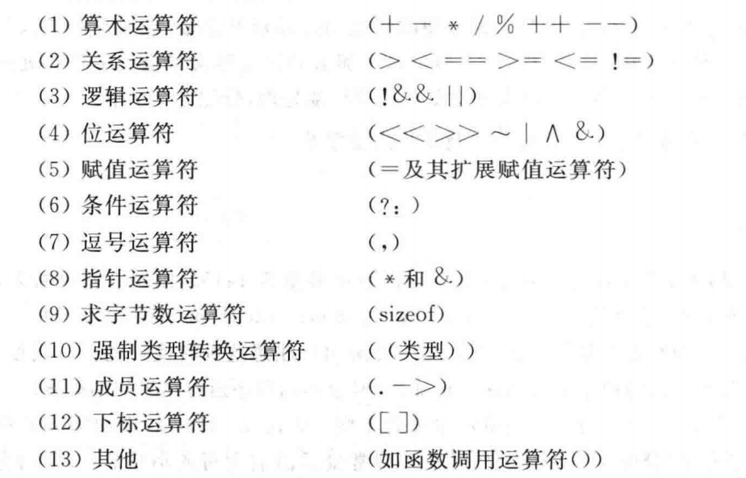

# 04-运算符与表达式

## 一 运算符

### 1.1 运算符分类

C 语言提供的运算符分类：



注意事项：

- 两个实数相除的结果是双精度实数
- 两个整数相除的结果是整数，如 5/3 结果为 1，舍去小数部分
- 如果除数和被除数存在一个负值，舍入方向由编译器决定，在 VC++中采取向零取整法(取整后向零靠拢)，`-5/3 = -1`
- %中参与运算的操作数必须为整数，结果也为整数
- ++i,--i：使用 i 之前，先使 i 的值改变 1
- i++,i--：使用 i 之后，再使 i 的值改变 1

## 二 表达式

### 2.1 算术表达式

用算术运算符和括号将运算对象（操作数）连接起来，符合 C 语言规则的式子称为 C 算术表达式，如：

```c++
a * b /c - 1.5 + 'a'
```

C 语言还规定了运算符的结合性，在表示求值时，先按运算符的优先级顺序执行。

### 2.2 逻辑运算符的使用

逻辑运算符中，逻辑非得优先级最高，逻辑或的优先级最低。下列逻辑运算结果为：

```txt
3 && 5            1
(6 > 7) || -3     1
```

从上得出：只要不等于 0，运算对象在逻辑表达式中就表示为真。

由 && 和 || 连接的表达式中，需要按照从左到右的顺序求职，一旦知明确表达式的值，求值过程就会立即停止，以避免不必要的运算。对于&&，如果其左侧表达式的值是 0，则整个逻辑表达式的值都是 0，也就不必要再运算右侧的值了。同理，当||左侧表达式部位 0 时，其右侧的表达式也不会被求值。

示例：假设变量 a，b，c 的值分别是 7,8,9，那么下列前两个逻辑表达式都只有第一个关系表达式会被求值，第三个逻辑表达式中的前两个关系会被求值：

```txt
(a > b) && (b > c) && (a > c)
(a < b) || (c > b) || (c > a)
(a < b) && (b > c) && (a > c)
(a > b) || (c < b) || (c != 0)
```

逻辑表达式的这一特性也称为：短路求值。

### 2.3 不同类型数据间的混合运算

如果运算符两侧的数据类型不同免责先进行自动类型转换，再运算，因此，整型、实型、字符型数据之间可以进行混合运算，其规律为：

- +，-，\*，/ 运算的两个数中有一个为浮点型，则结果是 double 型
- int 与 float/double 进行运损，先将 int 和 float 转换为 double，结果是 double
- 字符型与整型运算，会按照 ASCII 表运算，如果与实型数据运算，则转换为 doyble 后再运算

### 2.4 常用示例 闰年计算、水仙花数、名次预测

示例一：判断闰年。

```c
// 闰年条件1： 年份 y 不能被100整除时，但能被4整除则是闰年；
// 闰年条件2：年份 y 能被100整除时，只有当y能被400整除则是闰年
(y % 100 != 0 && y % 4 == 0) || (y % 400 = 0)
```

示例二：判断水仙花数

```c
// 水仙花数：三位正整数，各位数字的立方之和等于该数
(a * a * a + b * b * b + c * c * c) == (a * 100 + b * 10 + c)
```

示例三：ABCD 四人参加比赛，A 说：我不会夺冠，B 说：C 会夺冠，C 说：D 会夺冠，D 说：我不会夺冠。如果这些说法中只有一个是错误的，其逻辑表达式是：

```c
// 这里如果一个一个判断，那么产生的判断数量就会过多，其实根据四个预测的真假值之和即可，和必定为3
// M 设定为夺冠的人
(M != A) + (M  == C) + (M == D) + (M != D) == 3
```

示例四：在示例三的基础上延伸，ABCDEF 六人获得了前六名，有人预测了他们的名次，但是该预测只才对了 3 人的名次，那么其逻辑表达式是：

```c
(A == 1) + (B == 2) + (C == 3) + (D == 4) + (E == 5) + (F == 6) == 3
```

## 三 三目运算

```c++
#include <stdio.h>

int main(){
 int a = 10;
 int b = 20;
 int c;

 if (a > b){
  c = a;
 } else {
  c = b;
 }
 printf("c1 = %d\n", c);

 a = 1;
 b = 2;
 c = ( a > b ? a : b );
 printf("c2 = %d\n", c);

 return 0;
}
```

## 四 位运算

按位取反（~）：将每个 1 变为 0，将每个 0 变为 1

```c++
 unsigned char a = 2;   //00000010
 unsigned char b = ~a;  //11111101
```

按位与（&）：只有两个操作数的对应位都是 1 时结果才为 1

```txt
   (10010011)
 & (00111101)
 = (00010001)
```

按位或（|）：如果其中任意操作数中对应的位为 1，那么结果位就为 1

```txt
 (10010011)
  | (00111101)
  = (10111111)
```

按位异或（^）：如果操作数中的对应位有一个是 1(但不是都是 1)，那么结果是 1.如果都是 0 或者都是 1，则结果位 0

```txt
 (10010011)
  ^ (00111101)
  = (10101110)
```

## 五 移位运算符

### 5.1 左移

左移运算符<<将其左侧操作数的值的每位向左移动，移动的位数由其右侧操作数指定。空出来的位用 0 填充，并且丢弃移出左侧操作数末端的位。在下面例子中，每位向左移动两个位置。

```c
(10001010) << 2
(00101000)
```

该操作将产生一个新位置，但是不改变其操作数。

```c++
1 << 1 = 2;
2 << 1 = 4;
4 << 1 = 8;
8 << 2 = 32
```

**左移一位相当于原值\*2!**

### 5.2 右移

右移运算符>>将其左侧的操作数的值每位向右移动，移动的位数由其右侧的操作数指定。丢弃移出左侧操作数有段的位。对于 unsigned 类型，使用 0 填充左端空出的位。对于有符号类型，结果依赖于机器。空出的位可能用 0 填充，或者使用符号(最左端)位的副本填充。

```c++
//有符号值
(10001010) >> 2
(00100010)     //在某些系统上的结果值

(10001010) >> 2
(11100010)     //在另一些系统上的结果

//无符号值
(10001010) >> 2
(00100010)    //所有系统上的结果值
```

### 5.3 用法

移位运算符能够提供快捷、高效（依赖于硬件）对 2 的幂的乘法和除法。

- `number << n`：$number\times2^n$
- `number >> n`：如果 number 非负，则为 $number\div2^n$

## 六 强制类型转换

语法：(类型名)(表达式)

示例：

```c++
(double)a       # 将 a 转换为double
(float)(5 % 3)  # 将 5 % 3 转换为float
```

当自动类型转换不能实现目的时，可以使用强制类型转换，如：x 为 float 型，则`x%3`不合法，必须用`(int)x%3`。

强制类型转换获取浮点数的整数部分时，是按照该浮点数在计算机内部的实际值进行操作的，往往与所需结果不同，比如如下示例输出的是 3，而不是直觉上的 4：

```c
flot f = 0.04;
int x = (int)(f * 100);
printf("%d\n", x);
```

这是因为 f 中的数值由于 float 类型的精度略小于 4，乘以 100 也略小于 4，其整数部分其实是 3。该示例采用 double 则输出结果为 4。如果不能这样处理，f 必须是 float 类型，则可以将赋值语句修改为：

```c
int x = (int)((f + DEALT) * 100); // DEALT 是一个略大于数据精度误差的小数，比如 le-6
```

将浮点数转换为整数取整时，小数部分被完全舍弃了，得到的整数值会小于相应的浮点数值。有时候要对小数部分进行四舍五入，以保证取整后的值与原来浮点数的插值不大于 0.5，这时候可以将浮点数+0.5，再进行类型转换：

```c
double x;
int part = (int)(x + 0.5);
```

采用上述类似方法，可以对一个数值的任意位进行四舍五入处理，如：对浮点数小数点后的第 3 位进行四舍五入，保留两位小数；对整数的百位进行四舍五入，保留千位以上的有效数字。

强制类型转换的作用：

- 改变混合类型数据计算的默认类型转换规则
- 抑制编译系统对较宽类型向较窄类型变量赋值所产生的警告信息。

题目示例：输入一个 24 小时时间：`h:m`，0<=h<=23，0<=m<=59，均为整数，求该时刻时针和分针的夹角 A(0<=A<=180)，保留 3 位小数。
思路是：根据给定时间分别计算时针、分针相对某个参考方向的角度，相减后计算出夹角，这里参考方向为 12 点方向为起点，顺时针方向。

```c
#include <stdio.h>

int main(){

    int h, m, n;
    double ang_d, ang_h, ang_m, ang;

    scanf("%d:%d", &h, &m);

    // 将消失从区间[0,23]映射到 [0,11]
    h = h % 12;
    // 时针每小时转30度，每分钟转0.5度
    ang_h = h * 30.0 + m * 0.5;
    // 分针每分钟转6度
    ang_m = m * 6.0;
    // 将角度从-360~360映射到0-720度
    ang_d = ang_m - ang_h + 360;
    // 将角度从360~720映射到0~360
    ang_d -= ((int)ang_d / 360) * 360.0;
    // ang_d 大于180度时n位1，否则位0
    n = (int)ang_d / 180;
    // 将180~360间的角度映射到180~0
    ang = 360.0 * n + (1 - n * 2) * ang_d;
    printf("%.3f\n", ang);

    return 0;
}
```
