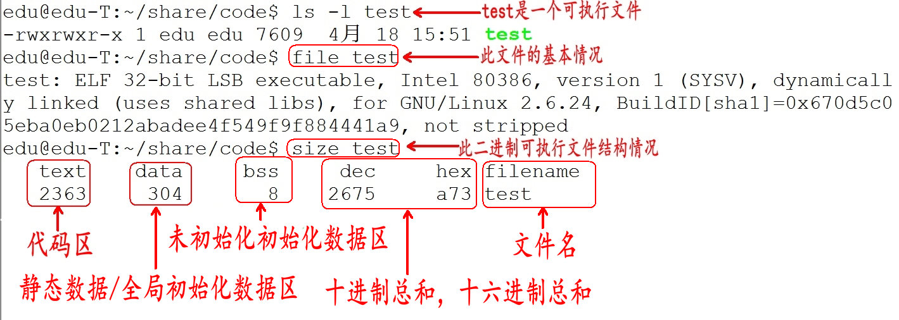
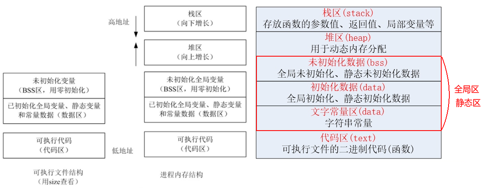

# 10.1-内存管理-内存布局

## 一 作用域

### 1.1 C 语言作用域分类

- 块级作用域：`{}`之间包围的部分
- 函数级作用域：函数内包含的部分
- 文件作用域：单个 C 文件包含的部分

### 1.2 局部变量

局部变量：即 auto 自动变量，auto 可省略，一般`{}`内部的变量都是局部变量。

```c++
#include <stdio.h>

void test() {
    auto int b = 10;// auto可省略
}

int main() {
    printf(b);      // 错误，main作用域中没有b
    return 0;
}
```

### 1.3 全局变量

全局变量在函数外定义，可被本文件中的函数共用。如果添加 `extern` 声明，则也可以被其他文件中的函数调用。

贴士：`extern`只是声明，不是定义，表示这个全局变量在别的文件中已经定义了。

全局变量的生命周期和程序运行周期一样，不同文件的全局变量不可重名。

注意：在 C 中，函数默认都是全局的，也可以在其他文件使用。

### 1.3 static 静态修饰符

static 可以修饰的变量是静态变量，该变量的生命周期和程序运行周期一致，且具备以下特性：

- 静态变量的值只能被初始化一次，但可以赋值多次
- 静态修饰的变量、函数，作用域都变为文件级，且不同文件中的可以出现重名
- 静态局部变量若未赋值，则系统自动赋值：数值型赋值为 0，字符型赋值为空字符

```c++
#include <stdio.h>

void test() {
   static int a;            // 静态局部变量
   a++;
   printf("a = %d \n", a);
}

int main() {
    test();                 // 1
    test();                 // 2
    return 0;
}
```

## 二 内存布局

### 2.1 运行前分区

C 源码默认生成了二进制文件：`a.out`，可以通过一些命令查看其基本情况`size a.out`，如图所示：



程序在没有运行前（即没有加载到内存前），可执行程序已经有了三段信息：

- **代码区 text**：存放 CPU 执行的机器指令
  - 通常可共享（即其他程序也可调用），共享的目的是只需要内存中保留一份即可
  - 代码区也规划了局部变量的相关信息
  - 程序在加载到内存前，代码区大小固定，运行期不能改变
- **数据区 data**：存储被初始化的全局变量，已经初始化的静态变量、常量
- **未初始化区 bss**：存入的是全局未初始化变量、未初始化静态变量，也可以将 data 和 bss 统一命名为静态区/全局区
  - 数据在程序开始执行前被内核初始化为 0 或者空 NULL
  - 程序在加载到内存前，bss 区大小固定，运行期不能改变

总体来讲说，程序源代码被编译之后主要分成两种段：程序指令(代码区)和程序数据（数据区）。代码段属于程序指令，而数据域段和.bss 段属于程序数据。程序在加载到内存前，代码区和全局区(data 和 bss)的大小就是固定的，程序运行期间不能改变。

那为什么把程序的指令和程序数据分开呢？

程序被 load 到内存中之后，可以将数据和代码分别映射到两个内存区域。由于数据区域对进程来说是可读可写的，而指令区域对程序来讲说是只读的，所以分区之后呢，可以将程序指令区域和数据区域分别设置成可读可写或只读。这样可以防止程序的指令有意或者无意被修改；
当系统中运行着多个同样的程序的时候，这些程序执行的指令都是一样的，所以只需要内存中保存一份程序的指令就可以了，只是每一个程序运行中数据不一样而已，这样可以节省大量的内存。比如说之前的 Windows Internet Explorer 7.0 运行起来之后， 它需要占用 112 844KB 的内存，它的私有部分数据有大概 15 944KB，也就是说有 96 900KB 空间是共享的，如果程序中运行了几百个这样的进程，可以想象共享的方法可以节省大量的内存。

### 2.2 运行中新增分区

程序运行中会额外增加栈区、堆区。



- **text 代码区**：加载的是可执行文件代码段，所有的可执行代码都加载到代码区，这块内存是不可以在运行期间修改的。
- **data 全局初始化数据区/静态数据区**：加载的是可执行文件数据段，存储于数据段（全局初始化，静态初始化数据，文字常量(只读)）的数据的生存周期为整个程序运行过程。
- **bss 未初始化数据区**：加载的是可执行文件 BSS 段，位置可以分开亦可以紧靠数据段，存储于数据段的数据（全局未初始化，静态未初始化数据）的生存周期为整个程序运行过程。
- **stack 栈区**：栈是一种先进后出的内存结构，由编译器负责自动分配、释放，存放函数的参数值、返回值、局部变量等。在程序运行过程中**实时**加载和释放，因此，局部变量的生存周期为申请到释放该段栈空间，也因为实时性导致栈区内存过大会加大 CPU 工作量。
- **堆区**：堆是一个大容器，它的容量要远远大于栈，但没有栈那样先进后出的顺序。堆在内存中位于 BSS 区和栈区之间，一般由开发者手动分配和释放，若程序员不释放，程序结束时由操作系统回收。

#### 2.3 内存分区总结

| 类型            | 作用域   | 生命周期       | 存储位置                            |
| --------------- | -------- | -------------- | ----------------------------------- |
| 局部变量        | {}内     | 当前函数       | 栈区                                |
| static 局部变量 | {}内     | 整个程序运行期 | 初始化在 data 段，未初始化在 BSS 段 |
| extern 变量     | 整个程序 | 整个程序运行期 | 初始化在 data 段，未初始化在 BSS 段 |
| static 全局变量 | 当前文件 | 整个程序运行期 | 初始化在 data 段，未初始化在 BSS 段 |
| extern 函数     | 整个程序 | 整个程序运行期 | 代码区                              |
| static 函数     | 当前文件 | 整个程序运行期 | 代码区                              |
| register 变量   | {}内     | 当前函数       | 运行时存储在 CPU 寄存器             |
| 字符串常量      | 当前文件 | 整个程序运行期 | data 段                             |

总结：

- 数据区包括：堆，栈，全局/静态存储区。
- 全局/静态存储区包括：常量区，全局区、静态区。
- 常量区包括：字符串常量区、常变量区。
- 代码区：存放程序编译后的二进制代码，不可寻址区。
  可以说，C/C++内存分区其实只有两个，即代码区和数据区。

## 三 函数调用模型

### 3.1 栈

栈(stack)是现代计算机程序里最为重要的概念之一，几乎每一个程序都使用了栈，没有栈就没有函数，没有局部变量，也就没有我们如今能见到的所有计算机的语言。

在经典的计算机科学中，栈被定义为一个特殊的容器，用户可以将数据压入栈中(入栈，push)，也可以将压入栈中的数据弹出(出栈，pop),但是栈容器必须遵循一条规则：先入栈的数据最后出栈(First In Last Out,FILO).

在经典的操作系统中，栈总是向下增长的。压栈的操作使得栈顶的地址减小，弹出操作使得栈顶地址增大。

栈保存一个函数调用所需要维护的信息，这通常被称为堆栈帧(Stack Frame)或者活动记录(Activate Record).一个函数调用过程所需要的信息一般包括以下几个方面：

- 函数的返回地址；
- 函数的参数；
- 临时变量；
- 保存的上下文：包括在函数调用前后需要保持不变的寄存器。

栈调用过程示例：

```c++
int func(int a,int b){
 int t_a = a;
 int t_b = b;
 return t_a + t_b;
}

int main(){
 int ret = 0;
 ret = func(10, 20);
 return EXIT_SUCCESS;
}
```


#### 3.2 调用惯例

如果函数调用方在传递参数的时候先压入 a 参数，再压入 b 参数，而被调用函数则认为先压入的是 b,后压入的是 a,那么被调用函数在使用 a,b 值时候，就会颠倒。

因此，函数的调用方和被调用方对于函数是如何调用的必须有一个明确的约定，只有双方都遵循同样的约定，函数才能够被正确的调用，这样的约定被称为”调用惯例(Calling Convention)”.一个调用惯例一般包含以下几个方面：

- 函数参数的传递顺序和方式：最常见的是通过栈传递，有些调用惯例还允许使用寄存器传递参数，以提高性能。
- 栈的维护方式：在函数将参数压入栈中之后，函数体会被调用，此后需要将被压入栈中的参数全部弹出，以使得栈在函数调用前后保持一致。这个弹出的工作可以由函数的调用方来完成，也可以由函数本身来完成。为了在链接的时候对调用惯例进行区分，调用惯例要对函数本身的名字进行修饰。不同的调用惯例有不同的名字修饰策略。

事实上，在 c 语言里，存在着多个调用惯例，而默认的是 cdecl.任何一个没有显示指定调用惯例的函数都是默认是 cdecl 惯例。

比如 func 函数的声明，它的完整写法应该是：

```c++
 int _cdecl func(int a,int b);
```

注意: \_cdecl 不是标准的关键字，在不同的编译器里可能有不同的写法，例如 gcc 里就不存在\_cdecl 这样的关键字，而是使用**attribute**((cdecl)).

| 调用惯例 | 出栈方     | 参数传递                                       | 名字修饰                   |
| -------- | ---------- | ---------------------------------------------- | -------------------------- |
| cdecl    | 函数调用方 | 从右至左参数入栈                               | 下划线+函数名              |
| stdcall  | 函数本身   | 从右至左参数入栈                               | 下划线+函数名+@+参数字节数 |
| fastcall | 函数本身   | 前两个参数由寄存器传递，其余参数通过堆栈传递。 | @+函数名+@+参数的字节数    |
| pascal   | 函数本身   | 从左至右参数入栈                               | 较为复杂，参见相关文档     |

#### 3.3 栈的生长方向和内存存放方向


```c++
//1. 栈的生长方向
void test01(){

 int a = 10;
 int b = 20;
 int c = 30;
 int d = 40;

 printf("a = %d\n", &a);
 printf("b = %d\n", &b);
 printf("c = %d\n", &c);
 printf("d = %d\n", &d);

 //a的地址大于b的地址，故而生长方向向下
}

//2. 内存生长方向(小端模式)
void test02(){

 //高位字节 -> 地位字节
 int num = 0xaabbccdd;
 unsigned char* p = &num;

 //从首地址开始的第一个字节
 printf("%x\n",*p);
 printf("%x\n", *(p + 1));
 printf("%x\n", *(p + 2));
 printf("%x\n", *(p + 3));
}s
```
